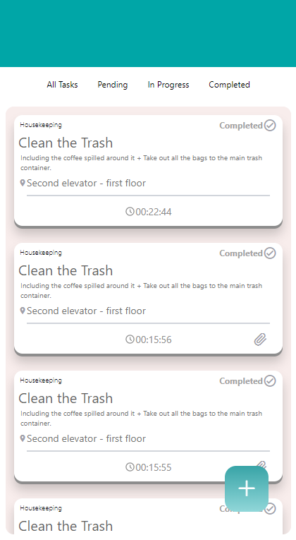

# Hotel-tasks-dashboard





## Table Of Content

- [Description](#Description)
- [Running the project](#Running-the-project)

## Description

This project's a tasks management dashboard for hotels. <br/>
The app allows creating new tasks, displaying them, filtering by status, and tracking their completion time. <br/>
The goal for this project was to learn React Native and to create pixel perfect UI by a design system from scratch and
predefined UI screens. <br/>
Used [Mirage.js](https://miragejs.com/) for API Mocking.

## Running the project

first clone the repo `git clone git@github.com:Refaelbenzvi24/Hotel-tasks-dashboard`

then run:

```shell
cd Hotels-tasks-dashboard
npm i
```

the run the following to start the dev server:

```shell
npm start
```
